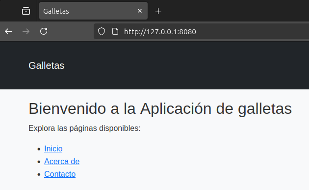
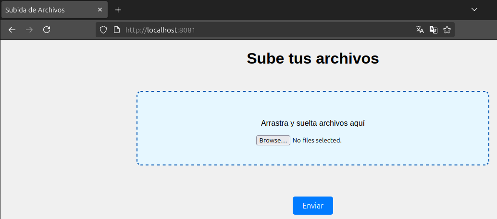

# Laboratorio de File Upload Y LFI

## Requerimientos para instalar

* PHP 8.3.6 (cli) 
* Apache Maven 3.9.9 

## Despliegue 

### Desplegar la aplicacion 1

```bash
cd php
php -S 127.0.0.1:8080
```

Verificar funcionamiento:

Visitamos: [http://127.0.0.1:8080/](http://127.0.0.1:8080/)




### Desplegar la aplicacion 2

```bash
cd app_upload
mvn clean package -DskipTests
java -jar target/upload-0.0.1-SNAPSHOT.jar
```
Visitamos: [http://127.0.0.1:8081/](http://127.0.0.1:8081/)

Deberia aparecer la siguiene ventana:



